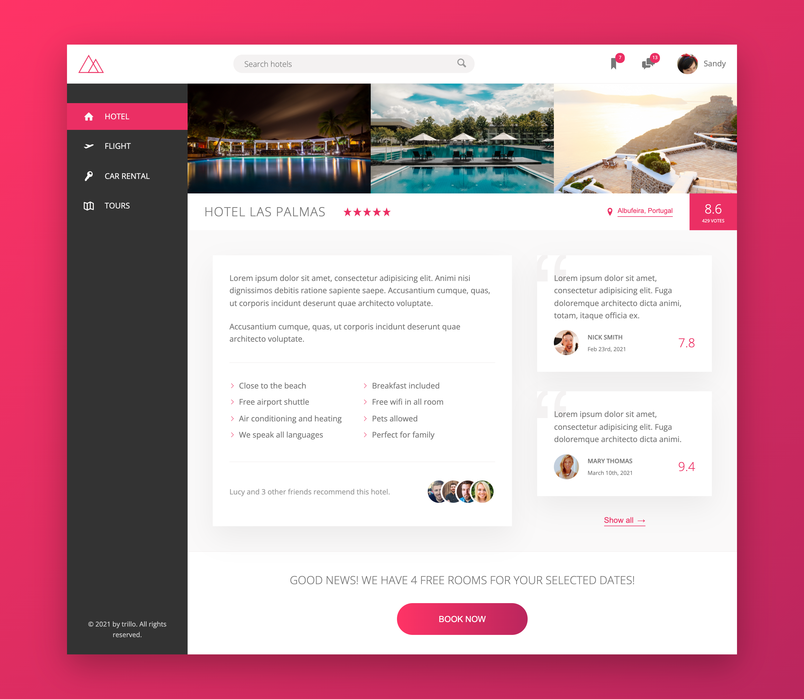

# Trillo Hotel Booking

## Table of contents

- [Overview](#overview)
  - [Live Preview](#Live-preview)
  - [Screenshot](#screenshot)
- [My process](#my-process)
  - [Built with](#built-with)
  - [What I learned](#what-i-learned)
  - [Continued development](#continued-development) -[Acknowledgements](#acknowledgements)

## Overview

### Live preview

[Click Here](https://bhornbhaya.github.io/trillo-hotel-booking/)

### Screenshot

## My process

### Built with

- Semantic HTML5 Markup
- CSS custom properties
- Flexbox
- Sass

### What I learned

- How to use CSS custom properties
- How to think about the overall layout of an app
- Use flexbox in a real world project
- How to find, generate and use SVG sprites in HTML
- Differences between SVG icons and font icons
- Flexbox alignment methods including justify-content, align-items, align-self, flex-direction, and flex property
- How to use scaleY and multiple transition properties with different settings, to create a hover effect
- How to use currentColor CSS variable
- How to create infinite animation
- How to use margin: auto with flexbox
- How to use CSS masks with mask-image and mark-size

### Continued development

- Display user menu when hovering profile photo
- Display menu when hovering chat icon
- Create caption when hovering the images
- Display search suggestions as soon as user start typing
- Make the page responsive for viewport size below 500px

## Acknowledgements

This project is a part of Advanced CSS and Sass: Flexbox, Grid, Animations and More by Jonas Schmedtmann
